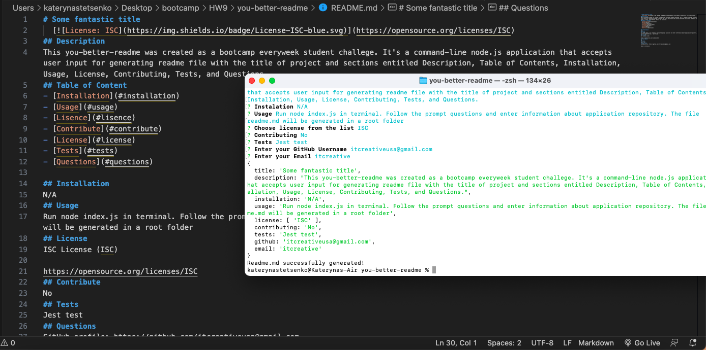

# you-better-readme

## Description

Link to deployed application
https://itcreativeusa.github.io/you-better-readme

Github link
https://github.com/itcreativeusa/you-better-readme

This you-better-readme was created as a bootcamp everyweek student challege.
It's a command-line application that accepts user input for generating readme file with the title of project and sections entitled Description, Table of Contents, Installation, Usage, License, Contributing, Tests, and Questions.

## Table of Contents (Optional)

- [Installation](#installation)
- [Usage](#usage)
- [Requirements](#requirements)
- [Credits](#credits)
- [License](#license)

## Installation

N/A

## Requirements

No special requirements

## Usage

Run node index.js in terminal.
Follow the prompt questions and enter information about application repository.
The file readme.md will be generated in a root folder

 Simply add text to the text field and press save. after reloading the page, the text will be available.
Screenshot located in `assets/images` folder

## Credits
 
 Starter code in files : index.html, style.css provided by Berkeley Bootcamp for studying purposes.

## License

Please refer to the LICENSE in the repo.
